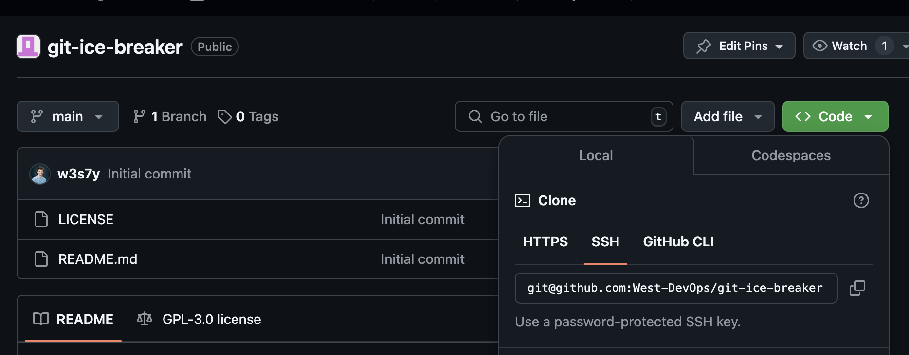
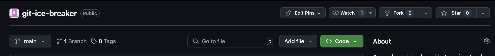
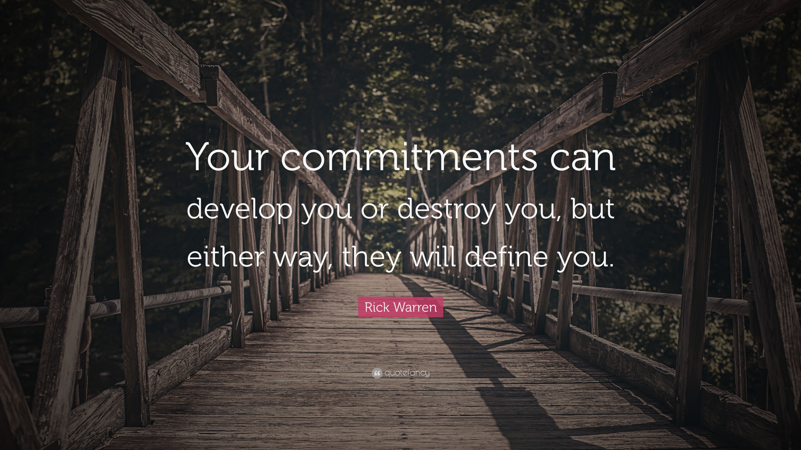
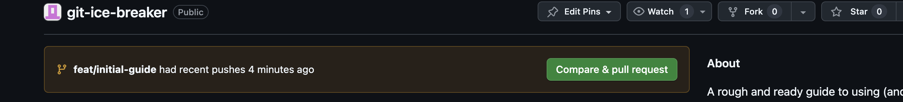
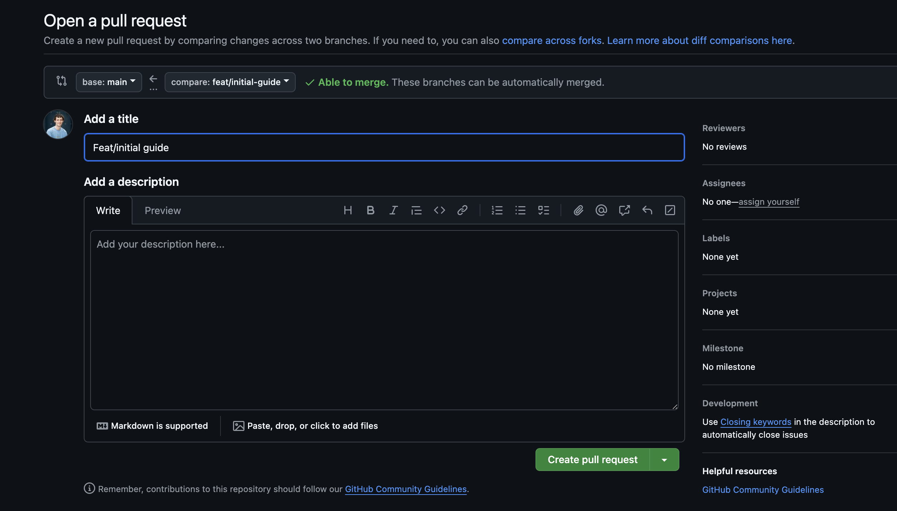
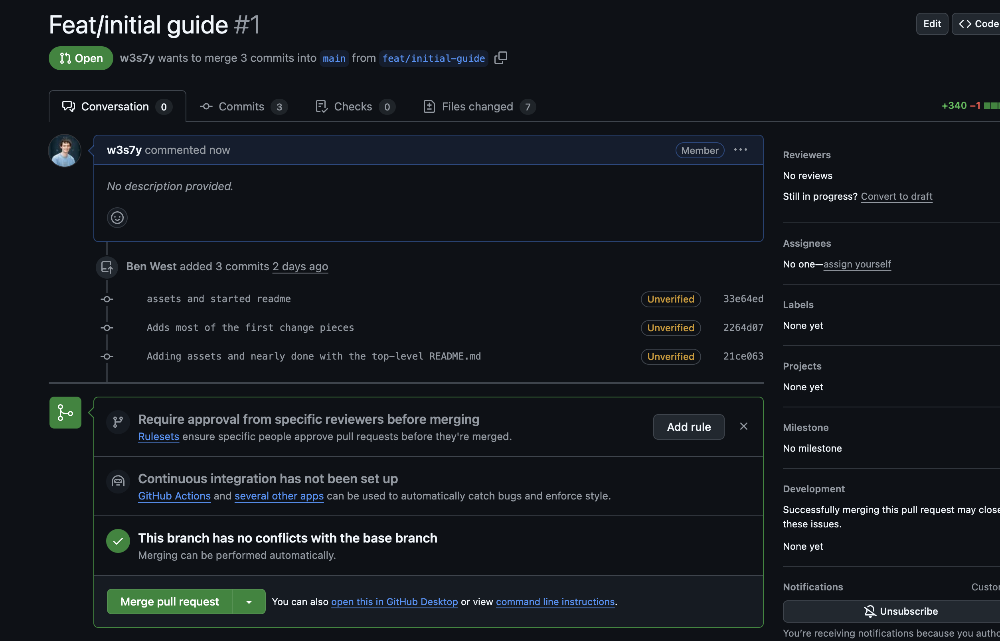
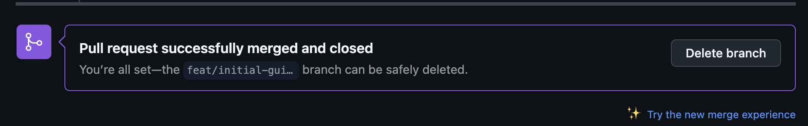

# git-ice-breaker
A rough and ready guide to using (and abusing) git via `cli`.  No IDE integrations, no fluff, just pure `git`.

## So what are we doing here? 

This guide will attempt to take someone who has 0 `git` experience and while it won't make you a hero it will give you
enough information and exercises to be comfortable using git in your projects and for sharing code with the wider world. 

## Getting started 

Here are just the very basics for installing and setting up `git`.  Once you have done the day zero config you shouldn't
ever need to rerun these commands. 

### Installing

Pretty simple, go here and pick your OS and download / install it.
* [Downloads](https://git-scm.com/downloads)

If you are on `*nix` systems it's very likely that your OS package manager will have `git` on there already, 
`brew` also has it on macOS.

### Day zero config

First of all setup your name and email in the global `git` config: 
```shell
git config --global user.name "My Name"
git config --global user.email "myname@email.com"
```

This means that these pieces of configuration will apply in _every_ repository you touch.

## Some concepts 

First we will go over some of the fundamental concepts that having a grasp of will allow you to quickly grasp `git` at
large... 

### The repository 

This is the top-level directory of a git repo, it will always have a `.git` directory in it and this is where `git` stores
the information required to build the entire history of the repository.  Every file ever created, changed, renamed or 
deleted.  It is all in the `.git` directory here!  We never go in and edit any files in the `.git` directory directly.  
But it is worth knowing that you entire change log for the repository lives here (i.e. don't delete it!).

Repositories will also have something commonly referred to as the `clone url`.  This is either a `ssh` ot `https` link.

The clone URLs for this repository are: 
* `git@github.com:West-DevOps/git-ice-breaker.git` for `SSH`
* `https://github.com/West-DevOps/git-ice-breaker.git` for `HTTPS`

You can find the clone URLs for any repo on the repo homepage under the green "Code" button: 


### Workflows 

Different developer teams will have different git workflows, these are usually defined and refined by teams as they 
find what works for them.  If you are starting out from scratch then you should probably familiarise yourself with 
some of the common workflows you can expect to find in projects using `git`:

* [The Github Flow](https://docs.github.com/en/get-started/using-github/github-flow) The standard for open source github hosted projects
* [Comparing Workflows](https://www.atlassian.com/git/tutorials/comparing-workflows) Good comparison from atlassian on a few
* [Git Workflows](https://git-scm.com/docs/gitworkflows) the OG.  Not used all too often anymore.

Ultimately, there is no single "right" answer or silver bullet when choosing (or switching) workflows.  Just pick the 
one that you think will work for your project and if it does not just pick another one and start doing that instead!
One of the beauties of git is that you are never bound to a single workflow once you pick it so live dangerously, 
commit direct to `main` for a while until you completely knobble your repo and realise that changing the `main` branch
directly is probably not the best workflow on earth! 

Good job you can `revert` changes in git! 

### Staging

One of the core concepts of `git` which comes up often as a trap for new gamers is the `stage`.  This is; put simply 
the changes you are making that will be `committed` when you call `git commit`.  As an example: 

Let's say we create a branch and check it out and then create two files in the repository, `a.txt` and `b.txt`:
```shell
git checkout -b feat/initial-guide
touch a.txt b.txt
```

Now we can check what git is thinking with the `git status` command (you will run this A LOT).

```shell
git status
```
Will give us
```text
On branch feat/initial-guide
Untracked files:
  (use "git add <file>..." to include in what will be committed)
        a.txt
        b.txt

nothing added to commit but untracked files present (use "git add" to track)
```

You can see `git` is saying these two new files are `untracked` This is essentially saying `unstaged changes`

We can add these files to the `staging area` with: 
```shell
git add a.txt b.txt
```

And if we run `git status` again: 
```text
On branch feat/initial-guide
Changes to be committed:
  (use "git restore --staged <file>..." to unstage)
        new file:   a.txt
        new file:   b.txt
```

Now these changes are said to be "staged" for commit, and as the help text says you can use `git restore` to unstage them.

## Your first commit

Now we have covered installing `git` and some of the core concepts, let's make a basic change to this repo! 

### To init or not to init? 

If you are writing some code from scratch it is possible to create a `git` repository locally with no connection to 
`github` or anything.  However, it is pretty un-common to do it this way round and far more common to create an 
empty repository on `github` and then `clone` that empty repo to begin development on a new project.  
This way you can leverage things like templates from `github` (or whatever source repo your organisation is using) 
and also have things like the `license` and `README.md` files auto-generated when the repo is created. 

### To fork or not to fork? 

Generally speaking fork if it's another persons repository and you have intentions of changing the codebase. 
If you just want their awesome code and won't be pushing updates/fixes/new features back to the original repo first of all:


> Shame bell for you

For most Free-open-source-software (FOSS) there is not only an expectation there is a clause in some licenses
that you must "pay it back" and if you modify the code in any way for any reason you should make those changes freely
available under the same license.  i.e. at least raise a PR from your fork to the original repo to see if the maintainers 
would like to see your changes merged back into the main repo.  If they merge your changes congratulations you are now a 
contributor to FOSS.  One for the CV ;) 

But if you just need the code and will use it as-is without changing it then feel free to just `clone` it.

As we (West-DevOps) are the owner of this repo you will not be able to push branches back to it so you _will_ need to
fork it locally.



The fork button at the top will allow you to `fork` this entire repository, all branches, tags, everything into a new 
repository under an organisation/person of your choosing.  

### Cloning repositories 

The first step in everything in the `git` world is getting the code onto your machine.  If you `forked` this repository 
to your own `github` account you should have been re-directed straight to it and you can now clone that `forked` copy

```shell
git clone <SSH or HTTPS clone url>
```

This will create a local copy of the repo on your machine.  

N.b. You will need to setup SSH in order to use the SSH clone urls 
[SSH Setup guide](https://docs.github.com/en/authentication/connecting-to-github-with-ssh/about-ssh)

### Creating a branch 

Now we have the local copy which will have the `defualt branch` checked out.  This branch is usually named `main` in
most `git` organisations.  It used to be called `master` so you might see some guides mention it as the default.

```shell
# You can show all local branches 
git branch 

# Or see all remote branches on the 'origin' (github)
git branch -r

# And to create a branch from the current branch (main) called 'feature/new-exercises'
git branch feature/new-exercises
```

You do not have to ever invoke this command directly though there is an easier way to create a branch.
See the next section...

### Checking out a branch 

Now we have created a branch we need to `checkout` that branch which we just created: 

```shell
# Checkout a pre-existing branch
git checkout feature/new-exercises

# Or more commonly to create a new branch from the current one AND check it out in one command
git checkout -b feature/new-exercises
```

Using the `-b` flag in the `checkout` command saves ever having to run `git branch`.  

### Making changes

Now we have created a branch and checked it out we can start working on the feature / bug fix or whatever the code 
needs.  You can make the individual changes (`commits`) as large or as small as you wish.  In general day-to-day 
operations it is advised to keep the changes as small as practicable.  This allows for easy reviews when someone else 
needs to review your code.  Let's imagine we need to add a new static asset to an imaginary web-app, the work required 
might look something like: 

* Adding the new image file `new_picture.jpg` to the `assets` folder
* Binding a url (`/img/new_picture.jpg`) to serve that file in the web-app framework.
* Writing tests for the web-app that requesting `/img/new_picture.jpg` actually serves up that new image. 

Now it _could_ be perfectly acceptable to do all of these steps in a single commit (and for a change this trivial you 
might well find commits out in the wild just like this one!) however for readability and also for `reverting` changes
it is generally better to perform logical pieces in individual commits.  Let's think about it some more: 

* If we commit the adding of the image to the repository that doesn't actually affect the end-user experience at all 
* Writing the tests could come before doing anything! (Test Driven Development)
* It is the "binding" of a URL to the image file path which actually makes material change to the web-app from an end-user perspective. 

So if it were me I would make 3 commits with commit messages as follows: 

1. Adds tests for new image `new_picture.jpg`
2. Adds `new_picture.jpg`
3. Adds url bind for `new_picture.jpg` to `/img/new_picture.jpg`

Now anyone who looks at the `git log` can clearly see which each commit does and if we wanted to remove the binding but
leave the image in the repo for production release later we could `revert` that 3rd commit and leave the rest in the repo. 

tl;dr - Take 2 minutes to think about the "shape" of your change before charging in and editing code! 

### Staging changes

now we have made some changes let's get them `added` to the `stage`.  First of all we can see what git thinks

```shell
# Probably the most common way to add changes to the stage.  For better or worse. 
git add .
```

The above command will attempt to add every single modified file from the `cwd` down.  So use with caution!  If you have 
multiple files changed but only want to commit one it's far better to use `add` on single files: 

```shell
git add assets/new_picture.jpg
```

### Checking status of the change 

Now changes are `staged` you can check the status and what the changes _actually_ are with the following commands: 

```shell
# Show a summary of staged and unstaged changes
git status 

# To show the unstaged changes as a diff 
git diff

# To show the staged changes as a diff 
git diff --staged
```

A lot of new gamers fall into the trap of staging their changes with `git add .` then freaking out when they run `git diff`
and see no changes.  Don't forget the `--staged` option to show diffs on staged files!

### Committing your changes 

So we have got all the way now, we have created and `checked out` our `branch`.  We have thought about the shape of the 
change and have `added` our files to the `stage`.  Now it's time to `commit`! 



Bad affirmations aside here is the command: 

```shell
git commit -m "Adds new feature X and tests"
```

### Checking the log 

Now you have some changes `committed` you can use the various flavours of the `log` command the see the log of commits. 

```shell
# Just see the commit log in a long format
git log

# See the log and the changes (diff) from each commit
git log -p  

# Short and sweet
git log --oneline --decorate

#  I'll let you work it out ;) 
git log --graph --pretty="%Cred%h%Creset -%C(auto)%d%Creset %s %Cgreen(%ar) %C(bold blue)<%an>%Creset" --all
```

### Pushing your changes 

Finally, we can push the changes to github! 

This is as simple as: 
```shell
# Straight push (not forcing update of the remote)
git push

# Force push (updates the history of the remote)
git push --force
```

Generally you will only need to `force push` if you have `rebased` locally.  These are semi-advanced? concepts and I 
wouldn't worry yourself too much about it if you are a one-man band as you will never get a merge conflict. 

Just use `git push` and carry on, also worth noting that when you `push` GitHub responds with a link to create a pull request
so you can do the next bit easily. 

### Raising a pull request / merge request

`merge` is `gitlabs` flavour, `pull` is `githubs` flavour.  They are _exactly_ the same thing / concept.  

> Get your code changes from a branch back into the default branch (usually main)

Now we depart from the commandline and get back into [Github](https://github.com/) and either use the link GitHub gave
you when you `pushed` your branch or navigate to the repos home page and you should find a nice big button: 



From here you can then create a pull request with a title, description and you can also change the `base` branch for
the PR (the branch you want to merge your changes into).  This is nearly always the `default branch` (`main`). 



Once you have filled out the title and description and attached any supporting files you wish you can hit the big
`create pull request` button at the bottom of the form and ta-da! you have just created your first PR! 

### Merging onto main 

Now we have a shiny new PR: 



It is at this point that pipelines would get automatically triggered to build and test the codebase on the branch so 
that you would have a continuous integration where changes are tested before they are merged.  Either way that's well
outside the scope of an intro to `git` but here's a link to [GitHub Actions](https://docs.github.com/en/actions) 
if you are interested in `CI/CD`.

Either way when you are happy that the changes are as you expect, all tests have been performed you can hit the big 
green `merge pull request` button and that's it.  You have just merged your code changes back onto `main`. 

There are other merge options such as `squash merge` and `rebase` merges but again this is more down to individual teams 
and organisations to decide what the `merge strategy` of an organisation looks like.  Sometimes even teams within 
organisations will have different strategies. 

After you have merged your branch you will be given the option to delete the branch your changes were on (it's uncommon
to leave a branch lying around after it's been merged.  Just delete it).



### Check main back out and pull the code changes

So now `main` has had our code changes merged onto it but wait!  my local copy of the repo is still on my old branch that
I just merged.  How do I prepare for doing another change? 

```shell
# First, checkout main
git checkout main

# As we do not have the changes we just made to main, this will actually modify our local copy of the repository to 
# before we merged onto main.  But we want to:
git pull
```

The `pull` command tells `git` to "Go to the remote and pull me down any changes to this branch".  This has the 
effect of pulling the commits we just added to `main` as part of our `pull request`.  

Now your local repo is on what's known as: 

> HEAD of main (or tip of main)

From here it's a simple `git checkout -b feat/my-second-feature` and you can start this cycle all over again! 

## Additional help and exercises

You can find a few exercises in the [exercises](./exercises.md) file and their solutions in [solutions](./solutions.md).

## External Resources

Here are the main players I used when learning: 

* [The git book](https://git-scm.com/book/en/v2) this is the _bible_/_master reference_ on `git`.
  * It is also a hard read for anyone new to `git`.  
  * You "don't know what you don't know" and this book gets very technical very quickly!
  * It may be better for a new `git` user to use some of the other resources first then come back to this one. 
* [Oh Shit Git!](https://ohshitgit.com/) a tongue in cheek look at some of the more esoteric use-cases of `git`. 
  * This will get you out of hot water quite often! 
* [W3 school git tutorial](https://www.w3schools.com/git/default.asp) I used this many, many years ago! 
* [Githubs Git Guide](https://github.com/git-guides) Never used but does look like a comprehensive guide! 

I'll stop now, you can google the rest!
